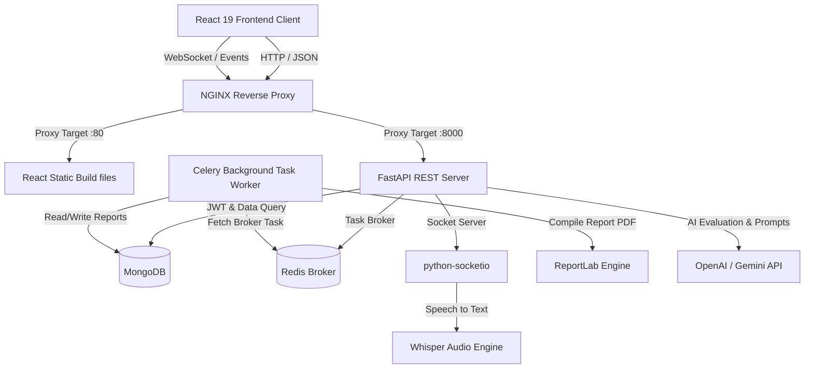

# InterviewAI

> Practice. Improve. Get Hired.

InterviewAI is a production-ready, full-stack AI Mock Interview SaaS platform. It enables candidates to experience mock interviews matching specialized roles (Frontend, Backend, ML, Behavioral, PM), complete coding challenges in a sandboxed Monaco editor, utilize webcam confidence analysis, and access detailed scorecard reports.

---

## Technical Architecture



- **Frontend**: React 19, TypeScript, Vite, Tailwind CSS, TanStack Query, React Hook Form, Recharts, Framer Motion, Monaco Code Editor, Socket.io client.
- **Backend**: FastAPI, Python 3.12, Motor (Async MongoDB Driver), Pydantic, Redis, Celery, python-socketio, Whisper, ReportLab.
- **Security**: Rate-limiters, strict browser security headers, bcrypt hashing, JWT access & refresh token rotation, input validation.

---

## Installation & Setup

Ensure you have **Docker** and **Docker Compose** installed on your machine.

### 1. Configure Environments

Create your backend configuration values:
```bash
cp backend/.env.example backend/.env
```

If you leave the AI key inputs empty, the platform automatically starts in **simulation mode** where all AI questions, answers, transcriptions, and reports are generated locally using mock models. This lets you inspect the platform immediately without configuration keys!

To enable real AI feedback, add your credentials in `backend/.env`:
```env
OPENAI_API_KEY=sk-...
GEMINI_API_KEY=...
```

### 2. Launch Docker Containers

Run the docker-compose stack:
```bash
docker-compose up --build -d
```

This starts:
- NGINX on `http://localhost` (proxying traffic).
- Frontend Static React App on `http://localhost`.
- FastAPI API Server on `http://localhost/api/v1`.
- Celery Task Worker for PDF report creation.
- MongoDB database container.
- Redis broker/cache container.

### 3. Seed Database

Once the containers are running, populate the database with mock records (interviews, score reports, test user metrics):

```bash
docker exec -it interviewai_backend python app/core/seed.py
```

### 4. Default Credentials

Use the default accounts created on startup or by the seeder script:

**Admin Superuser**
- Email: `admin@interviewai.com`
- Password: `AdminPassword123!`

**Candidate Practitioner**
- Email: `candidate@interviewai.com`
- Password: `CandidatePassword123!`

---

## Running Test Suites

Verify backend unit tests and code sandboxes locally:

```bash
cd backend
pip install -r requirements.txt
pytest tests/
```

Test coverage includes:
- JWT Access and Refresh authorization cycles.
- Monaco Code Sandbox compilation and execution rules (Python assertions check).
- Interview session generation schemas.

---

## API Documentation

FastAPI exposes an interactive OpenAPI (Swagger) dashboard once the server runs:
- Endpoint: `http://localhost/docs` or `http://localhost:8000/docs`

Key endpoint groups:
- `/auth`: Sign up, log in, token rotation, change passwords, and delete accounts.
- `/interview`: Create mock sessions, submit text/audio responses, complete sessions.
- `/coding`: Run user code in sandboxes and submit code responses.
- `/report`: Retrieve evaluation scorecards and stream ReportLab PDF reports.
- `/resume`: Upload PDF resumes and extract candidate skills.
- `/admin`: View analytics chart metrics and ban/unban users.
